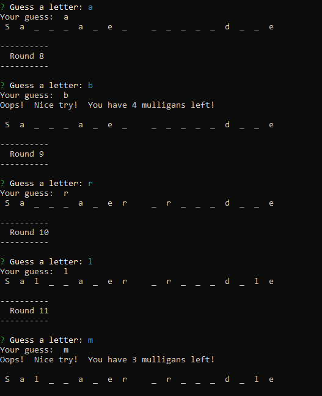
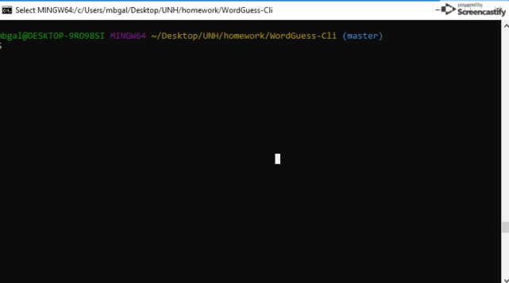

# WordGuess-Cli  
a word guess command-line game using Node and javascript constructor functions  
  
## American Megafauna Guessing Game  
  
Megafuana Word guess is a command line version of the classic hangman game. You won't graphics from the game (yet), but it does follow the same basic rules. The dictionary holds examples of megafauna (large animals) that are either extinct or still alive.  
  
The game plays as you might expect. The computer selects a random word and shows how many characters are in it.  It "gifts" you any spaces automatically.   You win by correctly guessing characters one by one that match a space on the board. The program will reveal the spots where the character matches. If you happen to guess incorrectly, it decrements you remaining guesses count. Unlike hangman, we don't put a stick figure up, it runs a countdown. But, just like Hangman, you only get 5 mistakes, if you miss a sixth time, you'll lose the round.  (e.g., 1 head, 1 body, 2 arms and 2 legs = 6)  
  
## Getting Started  
To get started,  copy the program to a clean directory and run "node index.js" on your command line. The program will prompt you to press enter a character to guess. From there,  simply use your keyboard to enter your guesses (and carriage returns). The game will ask you if you'd like to start another game at the very end  

## Example Screen Shot  
__1) node index.js__     
   Sample screen shot of a game in mid-action, showing correct and incorrect gueses  
  

__s) node index.js__     
   Sample video of a walkthrough of mulitple games showing full functionality  
  

## Developer Prerequisites  
A bash terminal window and Node.js  
A modern IDE - it was developed using Visual Studio Code, but any text editor would work, including notepad  
GitHub 
GitBash installed locally  
  
## Installing  
1.  Find a Locate an empty directory on your hard drive  
2.  Open a bash terminal in that directory  
3.  Clone the WordGuess-Game repo down from Github   
         "git clone https://github.com/five0ffour/WordGuess-Game.git"  
4.  Open Index.html in your favorite browser  
        It should display the game board and prompt you for an entry  
  
## Sample install    
1.  Install Node.js following the instructions at http://www.nodejs.com  
2.  Pull the repository down to a clean directory from Git http://fiveoffour.github.com/wordguess-cli  
3.  Open a bash window in that directory  
4.  Update the node package dependencies:   npm install  
5.  Run the game:  node index.js  
  
## Developer notes  
index.js:  main entry point, main game logic and inquirer user interface  
wordtable.js:  the source of the game's dictionary of words        
word.js:   the Word object which holds the logic for the word we're trying to find  
letter.js: a Letter object which holds matching and display logic for one letter  
  
## Built With  
Node.JS - the javascript engine  
Inquirer - the command line interface  
  
## Authors  
Michael Galanreau - Initial work - Five0fFour  

##Acknowledgments  
Inquirer  